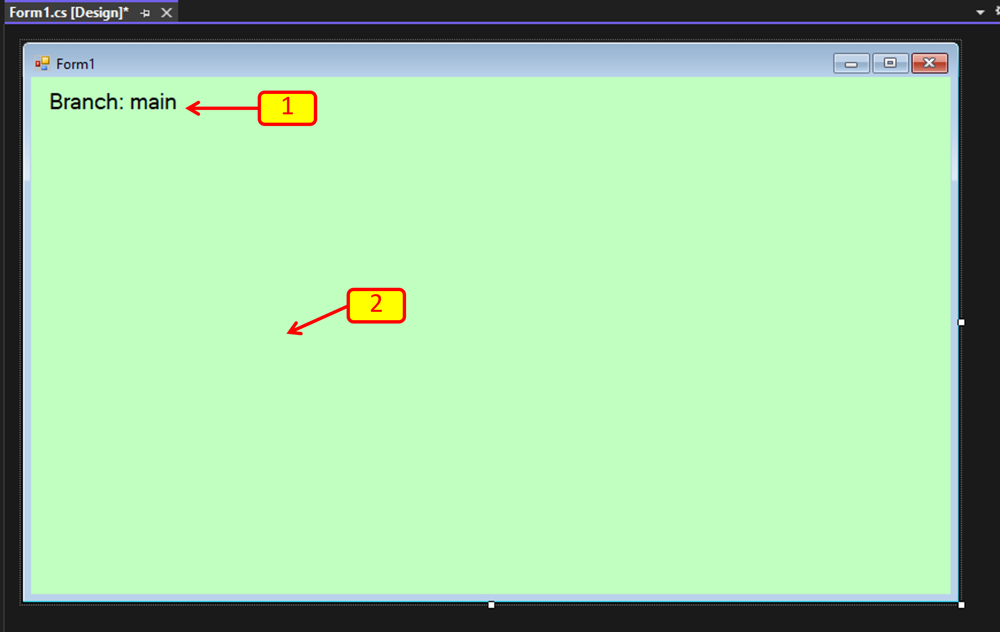
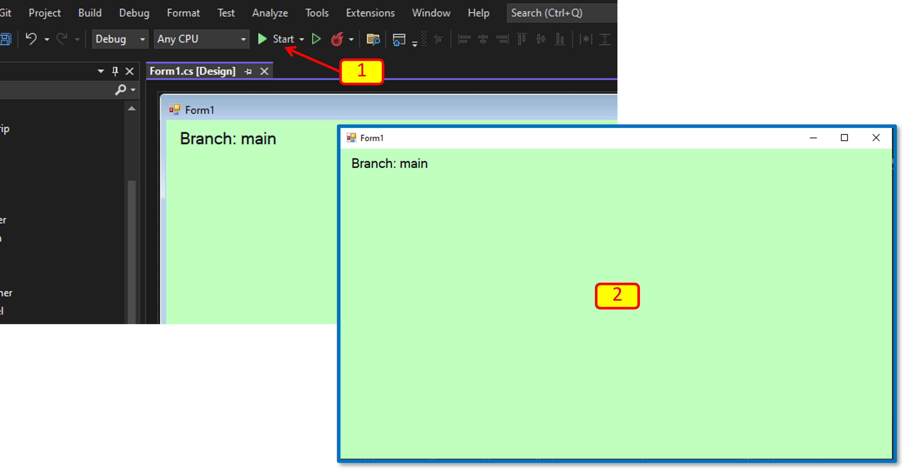
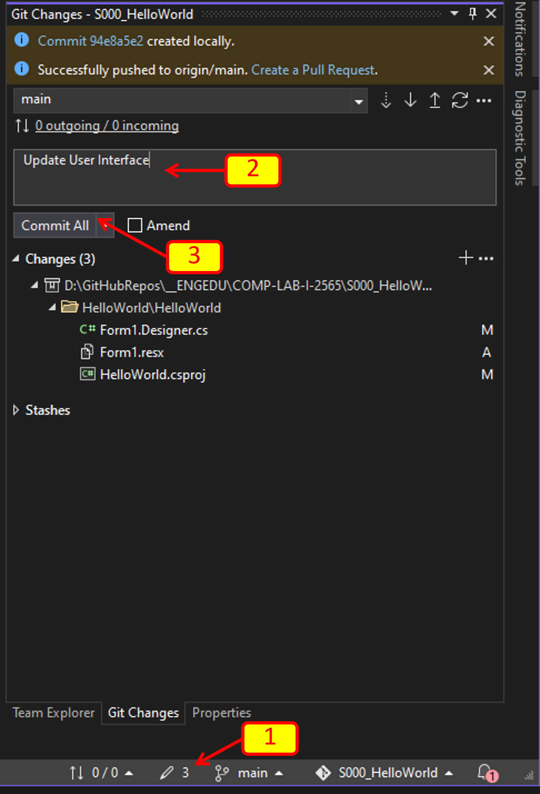

# 4. ทำงานกับ branch ใน visual studio 

1. ให้ทำการแก้ไข windows form เล็กน้อย เพื่อให้สามารถสังเกตุได้ว่าอยู่ใน Branch ใด

รายการแก้ไข

[1] เพิ่ม label และแก้ข้อความเป็น Branch:main  ขนาดฟอนต์ 14 pt

[2] เปลี่ยนสีพื้นหลังของ Form

2. ทดสอบการทำงานของโปรแกรม โดยการกด  start (F5)

[1] กด Start

[2] โปรแกรมจะรันและมีหน้าตาดังตัวอย่าง

3. ปิดโปรแกรม `Form1` และกลับไปที่ Visual Studio

ทำการ commit การเปลี่ยนแปลงให้เรียบร้อย

[1] ถ้าเลขหลังปุ่มดินสอนไม่เท่ากับศูนย์ แสดงว่ามีการเปลี่ยนแปลงเกิดขึ้นกับไฟล์ที่ git กำลัง tracking ให้กดปุ่มดินสอ เพื่อเรียกหน้าต่าง Git Changes ขึ้นมา

[2] ใส่ข้อความ commit

[3] กด `Commit All`
