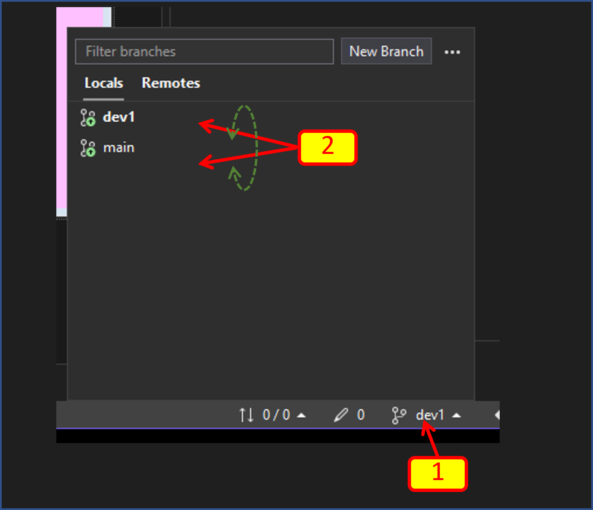

# 4. แก้ไขงานใน visual studio (branch main) 

4.1 ให้ทำการแก้ไข windows form เล็กน้อย เพื่อให้สามารถสังเกตุได้ว่าอยู่ใน Branch ใด

รายการแก้ไข

[1] เพิ่ม label และแก้ข้อความเป็น Branch:main  ขนาดฟอนต์ 14 pt

[2] เปลี่ยนสีพื้นหลังของ Form

4.2 ทดสอบการทำงานของโปรแกรม โดยการกด  start (F5)

[1] กด Start

[2] โปรแกรมจะรันและมีหน้าตาดังตัวอย่าง

4.3 ปิดโปรแกรม `Form1` และกลับไปที่ Visual Studio

4.4 ทำการ commit การเปลี่ยนแปลงให้เรียบร้อย

[1] ถ้าเลขหลังปุ่มดินสอนไม่เท่ากับศูนย์ แสดงว่ามีการเปลี่ยนแปลงเกิดขึ้นกับไฟล์ที่ git กำลัง tracking ให้กดปุ่มดินสอ เพื่อเรียกหน้าต่าง Git Changes ขึ้นมา

[2] ใส่ข้อความ commit

[3] กด `Commit All`

4.5 จะสังเกตเห็นว่าตัวเลขหลังปุ่มดินสอหายไปแล้ว  

[1] ตัวเลขหลังปุ่มดินสอหายไป แสดงว่าการเปลี่ยนแปลงทั้งหมดถูก commit แล้ว 

[2] ตัวเลขจะปรากฏตรงนี้แทน เลขดังกล่าวคือจำนวน commit ขาขึ้นไปยัง remote และขาลงมายัง local 

[3] ให้คลิกที่ปุ่มแสดงจำนวน commit

[4] Push การ commit ขึ้นบน remote reposiroty

จะเห็นว่าตัวเลขทั้งหมดใน git status เป็นศูนย์ แสดงว่าทุกการเปลี่ยนแปลงใน source code ถูก commit  และ sync กับ remote repository เรียบร้อยแล้ว

# 5. สร้าง branch ใหม่ด้วย visual studio (branch dev1) 

สมมติว่าเราต้องการเพิ่ม feature ให้โปรแกรมนี้ โดยที่จะยังคงเก็บรักษาโปรแกรมที่ work ใน branch main เอาไว้ และสามารถเรียกกลับมาใช้งานได้ในทุกเวลาที่ต้องการ

เราสามารถทำได้โดยการสร้าง branch ใหม่ขึ้นมา โดยสามารถเลือกได้ว่าจะใช้ branch ใดเป็นจุดเริ่มต้น (ในกรณีนี้มีเพิ่งจะมีเพียง branch เดียวคือ main)

5.1 สร้าง branch ใหม่

[1] คลิกที่สัญลักษณ์ branch 

[2] คลิกปุ่ม `New Branch` เพื่อสร้าง branch ใหม่  ในที่นี้เราจะให้ชื่อว่า `dev1`

5.2 ตั้งชื่อและเลือก base branch

[1] ตั้งชื่อ branch 

[2] เลือก base branch 

[3] สลับไปทำงานที่ branch ที่สร้างขึ้นใหม่ในทันที  

[4] กดเพื่อสร้าง  branch 

5.3 แก้ไขโปรแกรมได้ตามต้องการ 

เราสามารถแก้ไขส่วนต่างๆ ของโปรแกรมได้ตามต้องการ โดยจะไม่ส่งผลกระทบใดๆ ต่อโปรแกรมที่เขียนไว้แล้วใน branch main 

ถ้าเกิดปัญหาใดๆ ขึ้นใน branch นี้ เราสามารถสลับไปทำงานใน branch main หรือสร้าง  branch ใหม่ขึ้นมาอีก  (เช่น dev2, dev3 หรือชื่ออื่นๆ ก็ได้) เพื่อแก้ไขงาน ซึ่งจะไม่เกี่ยวข้องใดๆ กับ branch นี้แต่อย่างใด

[1] ส่วนที่แก้ไข 

[2] ทดสอบโดยการรันโปรแกรม 

ตัวอย่างโปรแกรมที่รันได้

ปิดโปรแกรมทดสอบแล้วกลับไปที่ Visual Studio

5.4 ในโปรแกรม Visual Studio สังเกตุที่ git status จะพบว่าที่เครื่องหมายดินสอ มีเลขที่ไม่ใช่ศูนย์ แสดงว่าไฟล์ที่ถูก tracking ถูกแก้ไข (จากการ edit form นั่นเอง)

ให้คลิกที่เครื่องหมายดินสอ แล้วทำการ commit, push ให้เรียบร้อยตามขั้นตอนที่ 4.4 - 4.5

# 6. การเปลี่ยนไปทำงานที่ branch อื่นๆ (branch main)

ในบางครั้ง เราต้องการกลับไปที่ feature เก่าๆ ของโปรแกรม หรือต้องการไปต่อยอดจาก branch เก่าๆ เราก็สามารถทำได้โดยการคลิกที่สัญลักษณ์ branch  แล้วคลิกที่ชื่อ branch ที่ต้องการเปลี่ยนไปทำงาน

[1] คลิกที่สัญลักษณ์ branch 

[2] เลือก branch ที่ต้องการ checkout

ก่อนจะเปลี่ยน branch ให้ระวังเรื่องการ commit ไฟล์ที่ถูกแก้ไข เพราะอาจจะเสี่ยงต่อการสูญเสียการแก้ไขได้ (สังเกตจากตัวเลขบนเครื่องหมายดินสอและ incoming/outgoing commit)

6.1 ลองสลับ branch แล้วกดปุ่ม start เพื่อรันโปรแกรม 

ก่อนสลับ branch ให้ทำการปิดโปรแกรมที่กำลังรันอยู่ก่อนเสมอ

# 7. ตรวจสอบ branch บน github.com
7.1 ไปเยี่ยม repository บน github.com  

ถ้าจำไม่ได้ก็ไม่ต้องกังวล มีทางลัดไปที่ repository บน browser

เราสามารถตรวจสอบจำนวน branch ได้ว่าสร้าง branch อะไรไปบ้าง แต่ละ  branch มีกี่ commit ตลอดจนรายละเอียดอื่นๆ 

# 8. ภาระกิจตอนต่อไป 

developer คนอื่นๆ สามารถ fork งานของเรา และทำการสร้าง branch เพื่อการพัฒนาต่อยอดได้เช่นเดียวกัน

เราสามารถใช้ความสามารถของภาษาโปรแกรมร่วมกับ repository  ที่ทำหน้าที่เป็นศูนย์กลางในการสร้าง application ขนาดใหญ่ที่คนจำนวนมากสามารถทำงานร่วมกันโดยไม่ส่งผลกระทบซึ่งกันและกัน โดยผู้ใช้สามารถเลือก feature ของโปรแกรมได้ตามต้องการ โดยไม่ต้องแก้ไข code แม้แต่บรรทัดเดียว 

แล้วเจอกันในใบงานถัดไป....