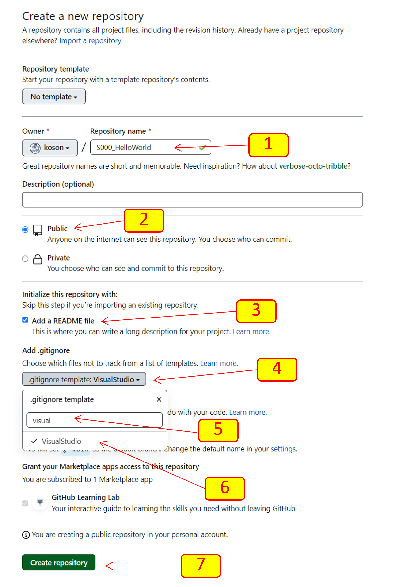
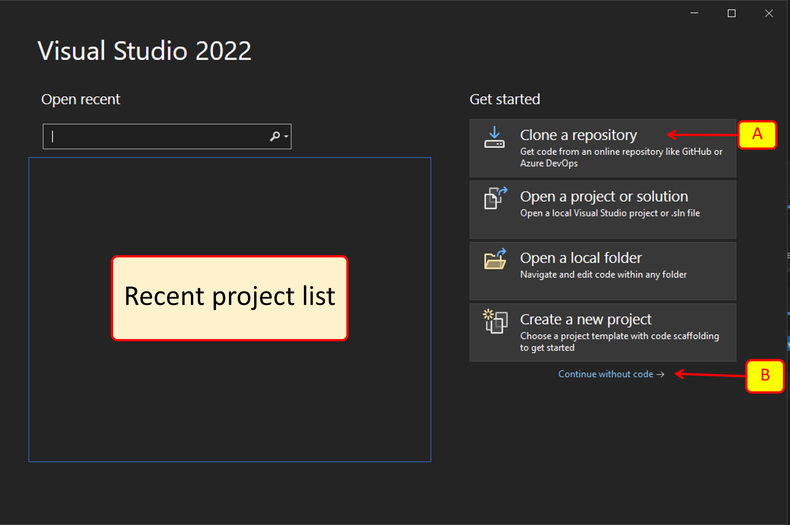
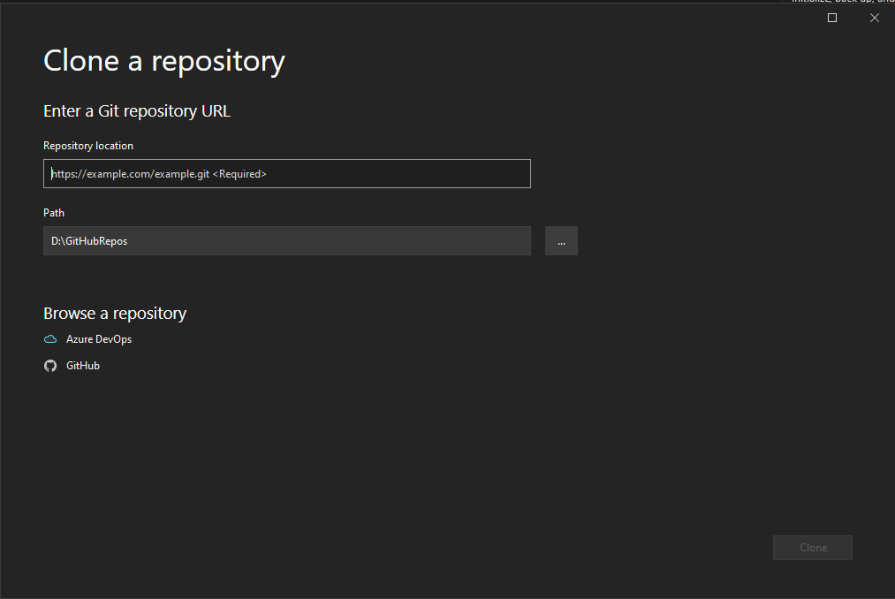

# COM-LAB-I-LabSheet-5

# การใช้งาน git ร่วมกับ Visual studio IDE #

## 1.  สร้าง repository ใหม่บน github.com

 1.1 สร้าง repository บน GitHub.com โดยมีรายละเอียดดังนี้
    <ul>
      <li> Repository name : Sxxx_HelloWorld <i>[โดย xxx คือเลขสามตัวท้ายของรหัสนักศึกษา]</i>
      <li> [X] Initialize this repository with a README
      <li> [ Add .gitignore : VisualStudio] 
    </ul>

[1] ตั้งชื่อ repository  
[2] เลือก Public  
[3] เลือก Add a README file  
[4] คลิก .gitignore template  
[5] ค้นหาโดยพิมพ์ visual  
[6] เลือก VisualStudio  
[7] คลิก `Create Repository`  

## 2. Clone repository ใน Visual Studio

2.1 เรียกโปรแกรม Visual Studio ขึ้นมา

2.2 ในหน้าต่างแรกจะปรากฏชื่อ project ที่เคยเปิด  ในกรณีนี้ เราจะทดลองเรื่องการ clone repository นักศึกษาทีทางเลือกได้ 2 ทางคือ

1. เลือก `Clone a repository` หรือ  
2. เลือก `Continue without code` ถ้าเลือกทางเลือกนี้ เราสามารถ clone repositpry ได้จากเมนู Git  ในหน้าต่าง Visual Studio

ทั้งสองทางเลือก จะนำไปสู่หน้าต่างเดียวกันคือหน้าต่าง `Clone a repository` ดัวรูปที่ 3

