# COM-LAB-I-LabSheet-5

# การใช้งาน git ร่วมกับ Visual studio IDE #

## 1.  สร้าง repository ใหม่บน github.com

 1.1 สร้าง repository บน GitHub.com โดยมีรายละเอียดดังนี้
    <ul>
      <li> Repository name : Sxxx_HelloWorld <i>[โดย xxx คือเลขสามตัวท้ายของรหัสนักศึกษา]</i>
      <li> [X] Initialize this repository with a README
      <li> [ Add .gitignore : VisualStudio] 
    </ul>

[1] ตั้งชื่อ repository  
[2] เลือก Public  
[3] เลือก Add a README file  
[4] คลิก .gitignore template  
[5] ค้นหาโดยพิมพ์ visual  
[6] เลือก VisualStudio  
[7] คลิก `Create Repository`  

### *** อย่าเพิ่งปิด web browser เราจะกลับมาที่นี่อีกครั้งเร็วๆ นี้ ###

## 2. Clone repository ใน Visual Studio

2.1 เรียกโปรแกรม Visual Studio ขึ้นมา

2.2 ในหน้าต่างแรกจะปรากฏชื่อ project ที่เคยเปิด และปุ่มอีก 4 ปุ่ม ในกรณีนี้ เราจะทดลองเรื่องการ clone repository นักศึกษาทีทางเลือกได้ 2 ทางคือ

A. เลือก `Clone a repository` หรือ  
B. เลือก `Continue without code` ถ้าเลือกทางเลือกนี้ เราสามารถ clone repositpry ได้จากเมนู Git  ในหน้าต่าง Visual Studio

ทั้งสองทางเลือก จะนำไปสู่หน้าต่างเดียวกันคือหน้าต่าง `Clone a repository` ดัวรูปที่ 3

2.3 กลับไปที่หน้าต่าง repository ที่สร้างในข้อ 1.1 

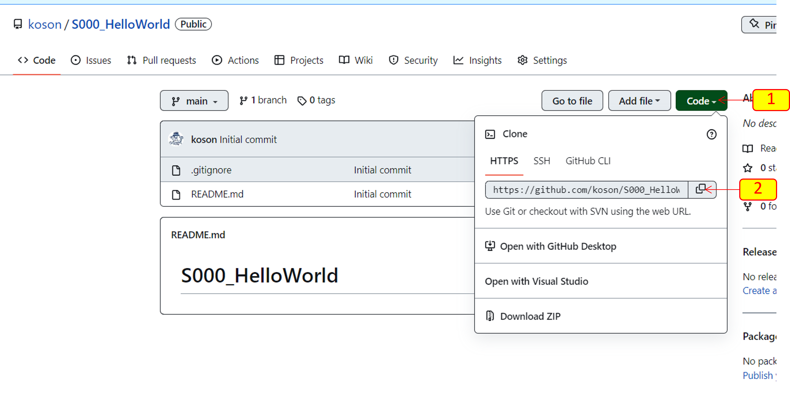

คัดลอก url ของ repo ไว้ใน clipboard (คลิกตาม `<---[1]` และ `<---[2]`)

นำ url มาใส่ในหน้าต่าง Clone a repository ของ Visual Studio ดัง [1] ใน รูปด้านล่างนี้ อย่าลืมเลือกที่ตั้งของ repo  (working directory) ที่จดจำได้ง่าย และไม่ตรงตามข้อห้าม เช่นชื่อที่ไม่ใช่ภาษาอังกฤษหรือมีอักขระพิเศษเช่น space bar  ในชื่อ folder แล้วคลิก Clone  

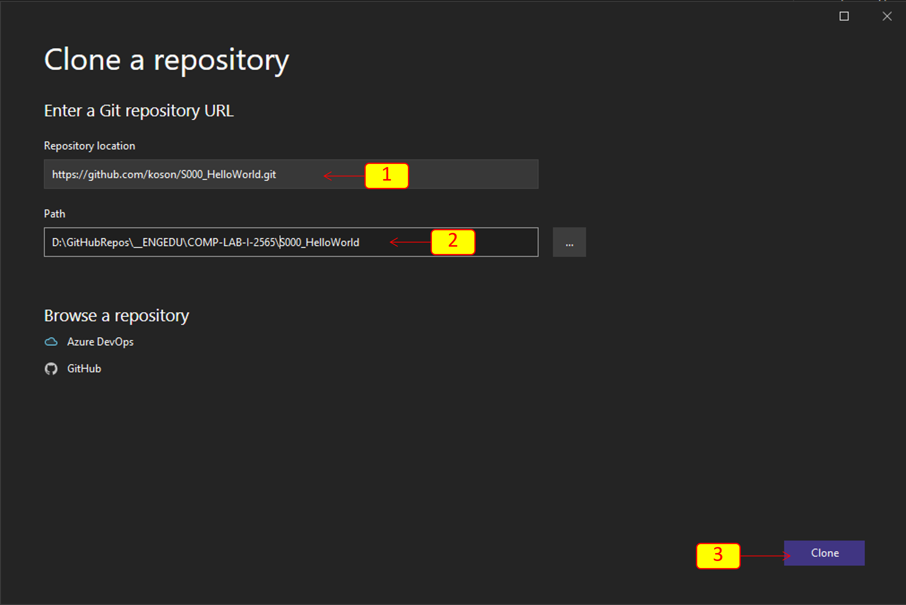

Visual studio จะเปิดหน้าต่างหลักขึ้นมา และมีการเชื่อมโยงกับ  Repository ที่เรา clone มาแล้ว สังเกตุได้จากที่มุมขวาล่างของหน้าต่าง Visual studio

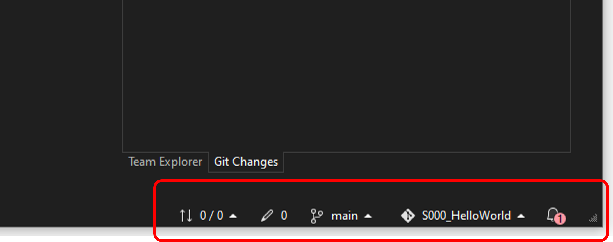

 

## 3. สร้าง Windows Form Application และส่งขึ้นไปเก็บบน github.com

3.1  สร้างโปรเจคใหม่

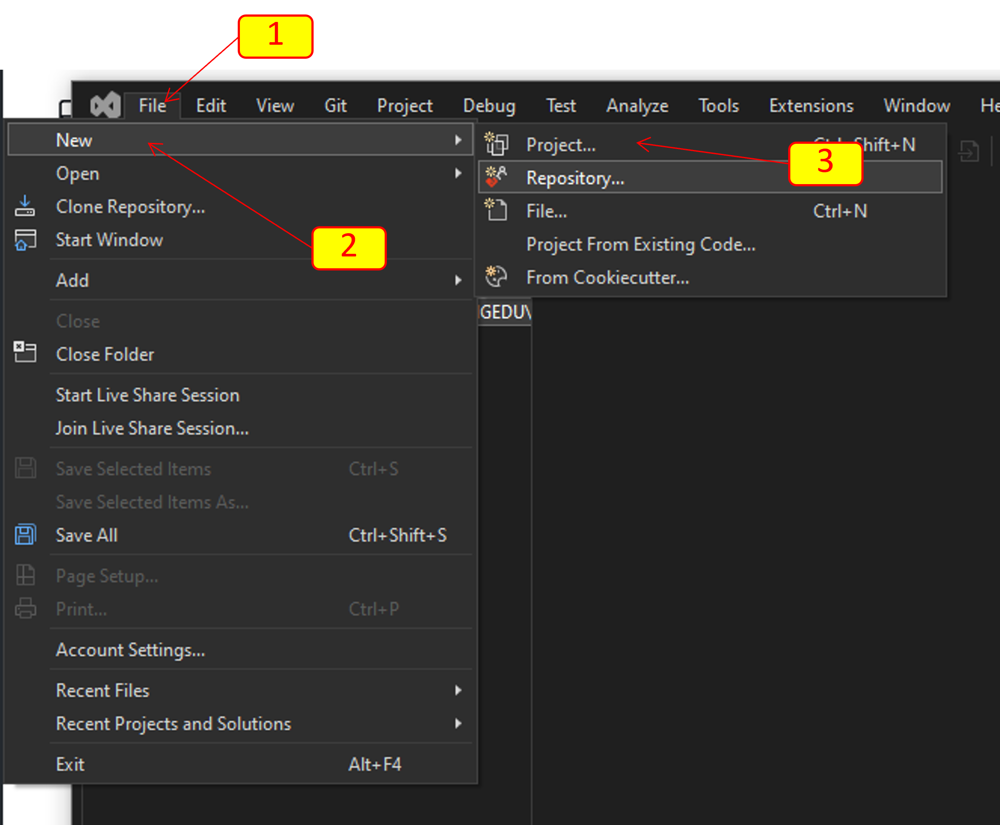

คลิกที่เมนู `File` -> `New` -> `Project...`  

3.2 เลือกชนิด project

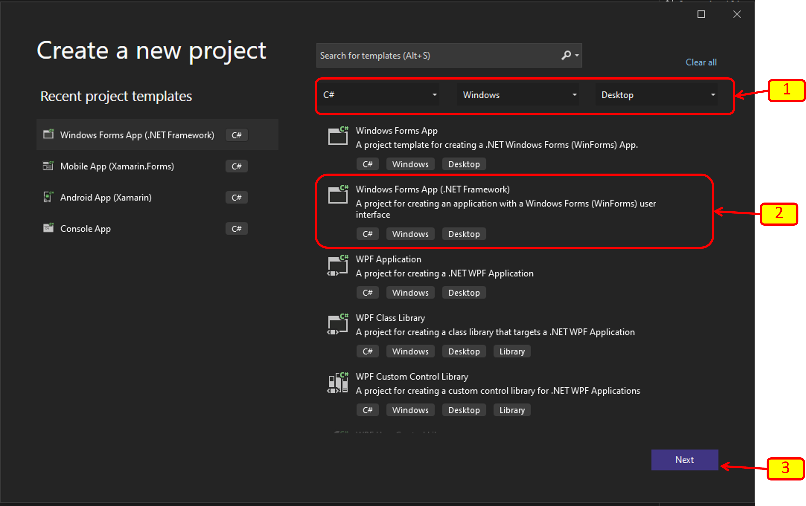

3.3 ตั้งชื่อและ  path ของ project

#### *** อย่าลิมเลือก path ให้ถูกต้อง นั่นคือต้องอยู่ใน folder ที่ clone มา (working directory) ####

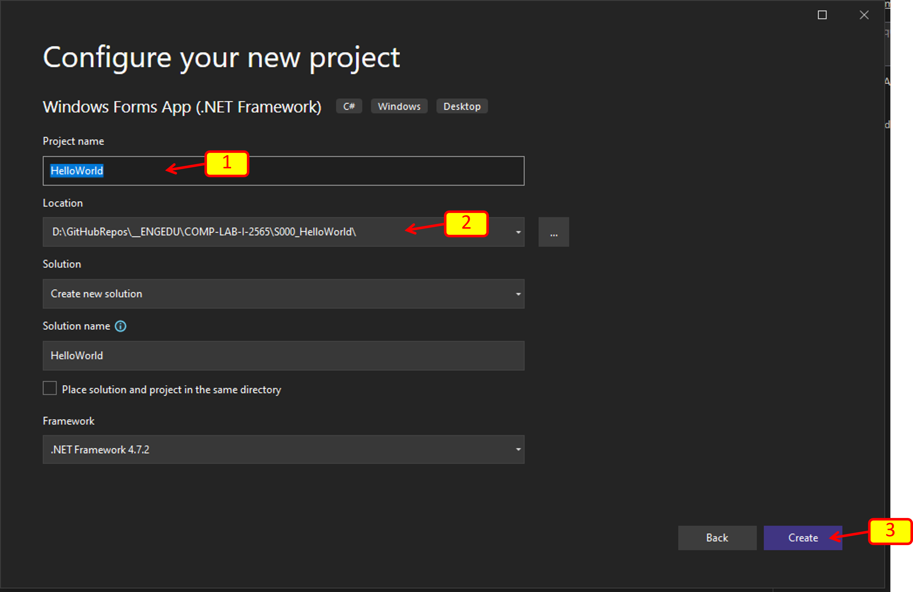

3.4 เมื่อกดปุ่ม `Create` Visual Studio จะสร้าง Project พร้อมทั้งติดตามการเปลี่ยนแปลงของไฟล์ต่างๆ ให้เราด้วย 

โดยที่ส่วนต่าง ๆ สำหรับการสร้าง Application ยังคงเหมือนเดิม

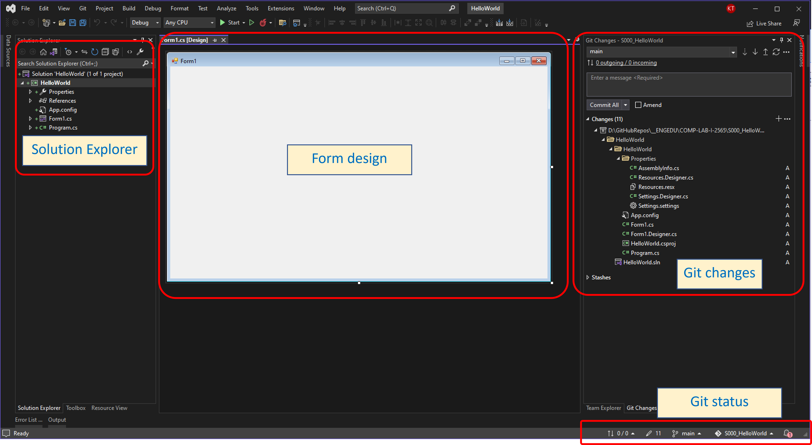

3.5 หน้าต่าง Git Changes จะบอกถึงจำนวนไฟล์ที่มีการเปลี่ยนแปลง 

ในกรณีนี้ เราสร้าง project ใหม่ ทำให้มีไฟล์ใหม่จำนวนเยอะมาก (ปกติเราจะแก้ไข source code ครั้งละจำนวนไม่มากนัก)

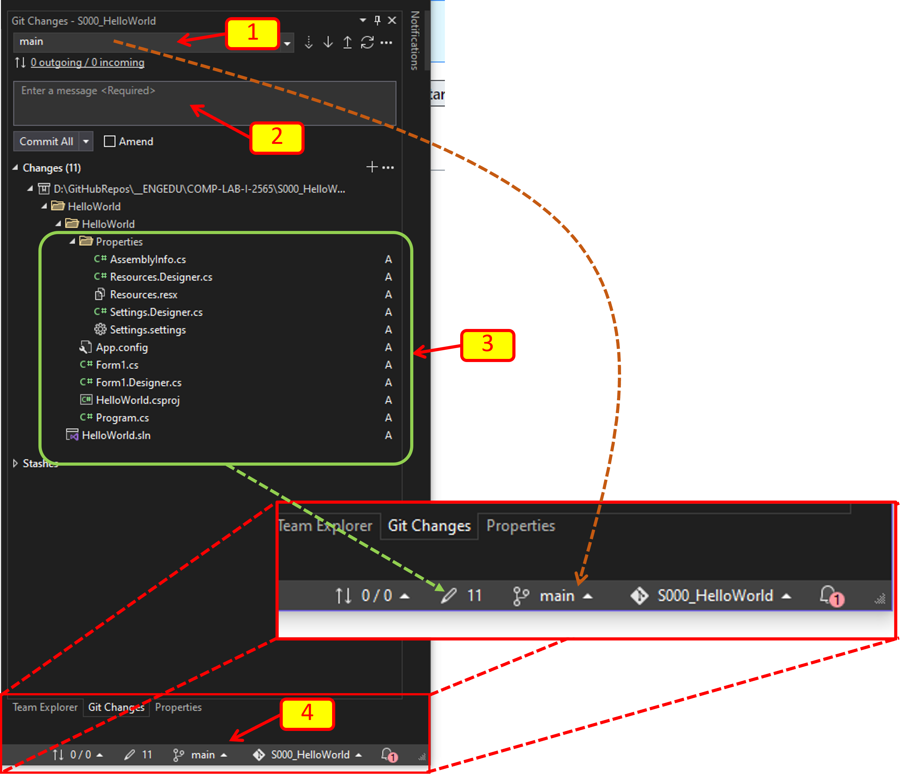

จากรูป 

[1] คือ branch ปัจจุบัน ชื่อว่า `main` ซึ่งจะปรากฏในแถบ status bar ด้้านล่างด้วย (ตามเส้นประสีส้ม)

[2] คือ edit box ที่ให้ใส่ข้อความ commit

[3] คือ ไฟล์ที่มีการเปลี่ยนแปลงหลังจากการ commit ครั้งล่าสุด 

[4] คือ git status อย่างย่อของ repositpry นี้

3.6 เพิ่มข้อความ commit ใน  [2] แล้วกด `Commit All`

ซึ่งถ้าเป็น command line  เราจะสั่ง `git commit -m "message"` นั่นเอง

โดยปกถ้าเป็น commit แรกจะนิยมใช้ `"initial commit"`

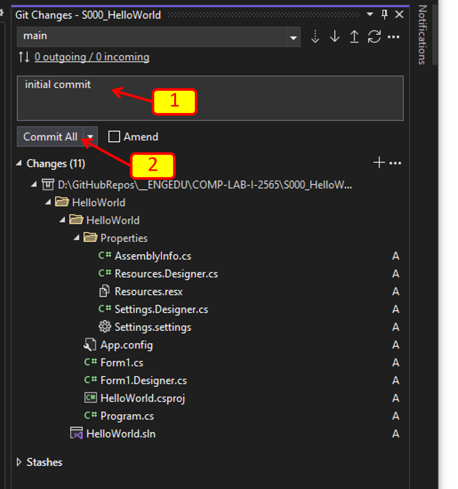

3.7 กลับไปตรวจสอบ repo บน web browser

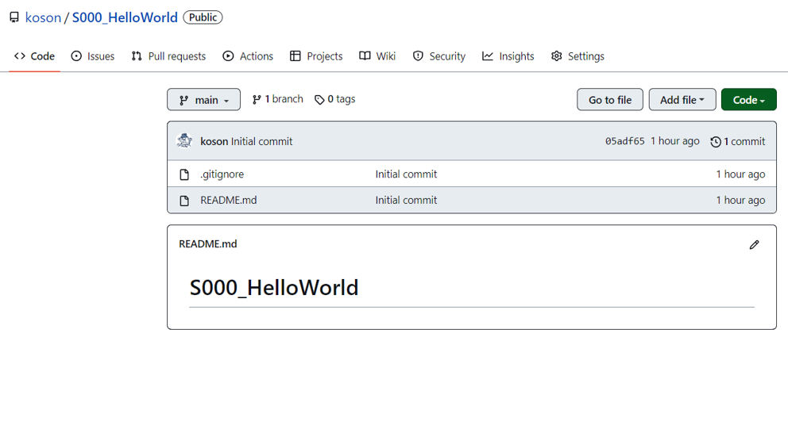

3.8 ทำการ push การเปลี่ยนแปลงขึ้นบน github.com

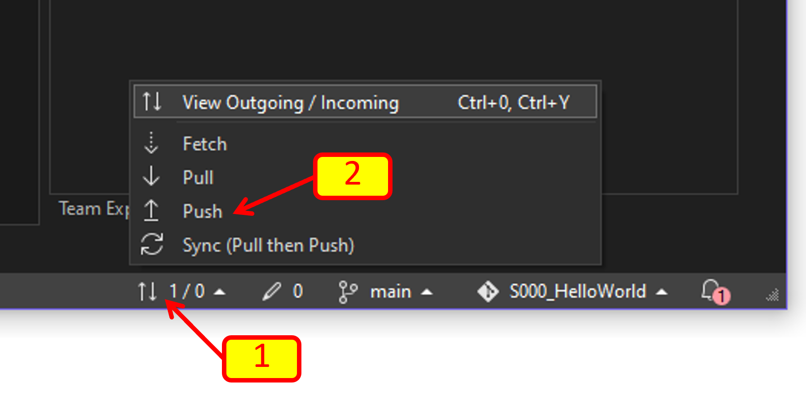

3.9 กลับไปตรวจสอบ repo บน web browser อีกครั้ง

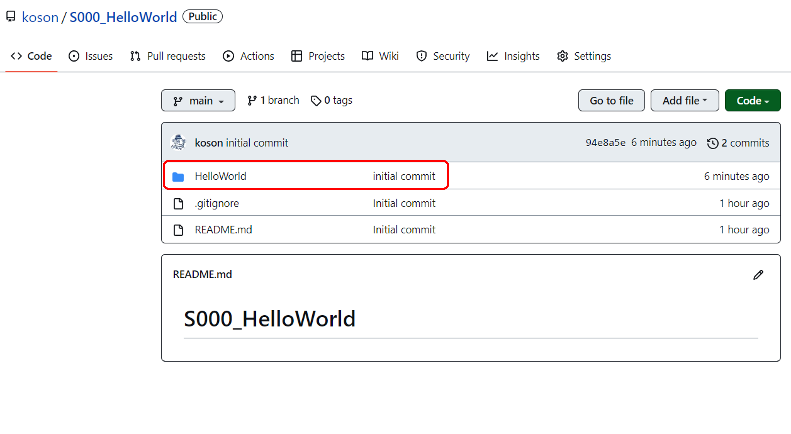

จะพบว่ามีการนำ folder ของ project ขึ้นไปเก็บบน github เรียบร้อยแล้ว 

และ visual studio ก็ทำการติดตามไฟล์ที่เราเปลี่ยนที่ local ให้ด้วย

